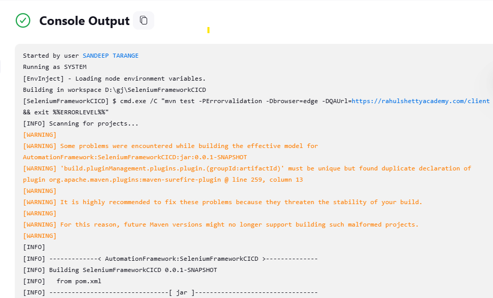
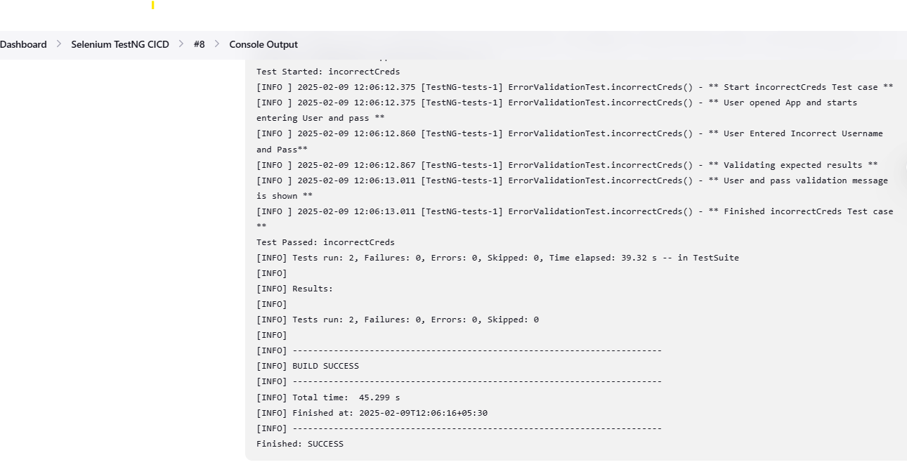
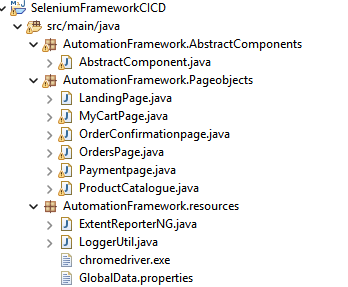
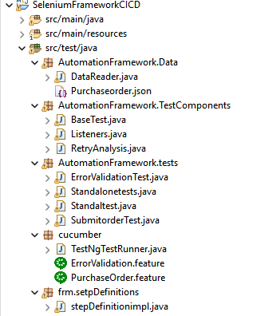
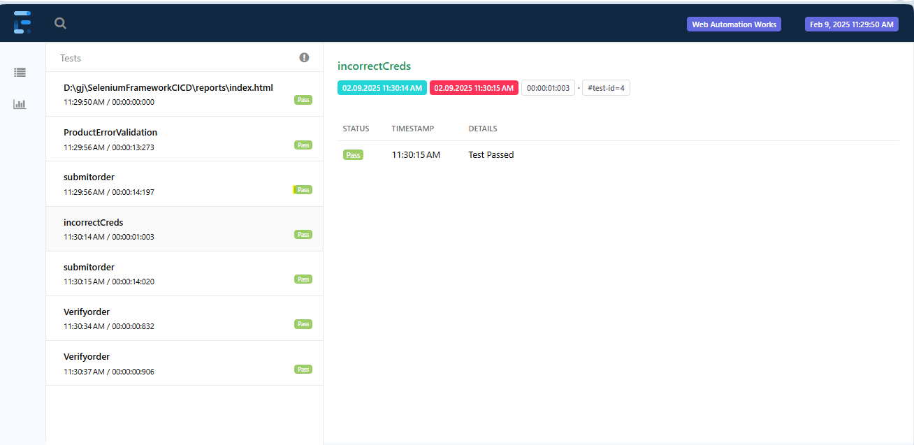
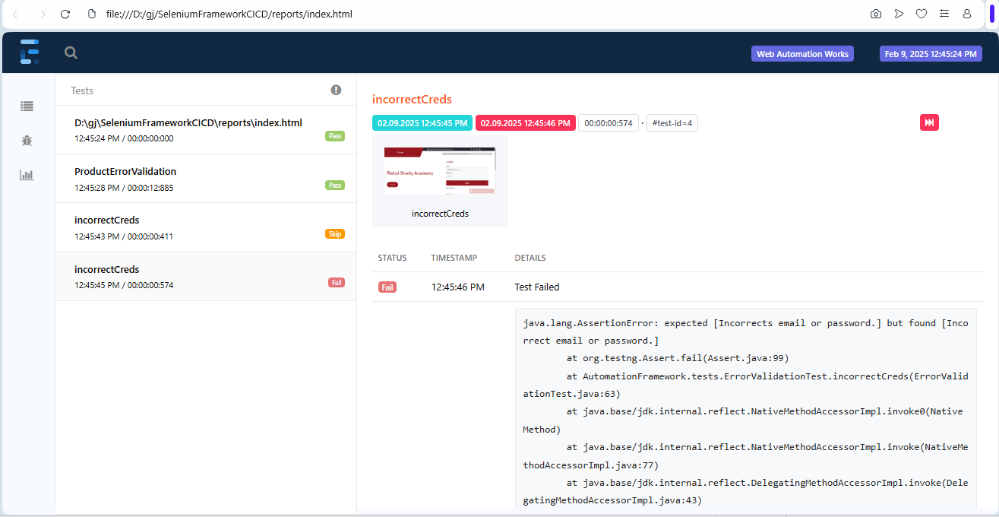
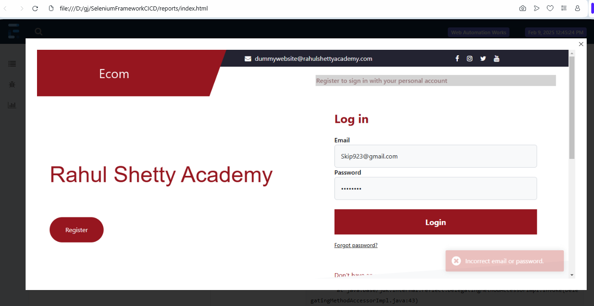
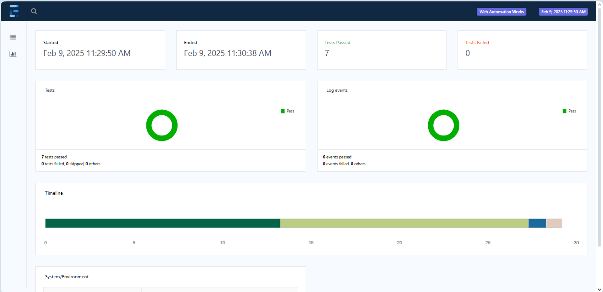
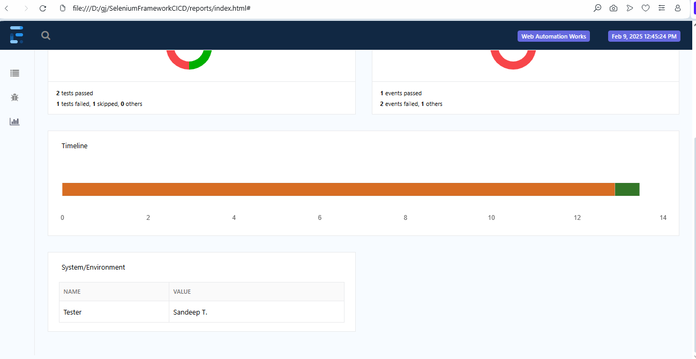

# Ecommerce App Automation Framework

## Overview
Ecommerce App Automation is a test automation framework developed using Java, Selenium, Maven, and Jenkins (CI/CD). This framework is designed to automate various test cases for the Ecomm app (SauceDemo) application, ensuring the reliability and efficiency of the application through continuous integration and continuous delivery (CI/CD). The test results are generated using Extent Reports, providing comprehensive insights into the test execution.






## Features
- **Automated Test Cases**: A set of predefined test cases for critical functionalities of the Ecomm application.
- **Cucumber Wrapper Support**: Integration with Cucumber for behavior-driven testing and seamless reporting.
- **Cross-Browser Testing**: Supports running tests on Chrome, Firefox, Edge, and Chrome in headless mode.
- **Screenshot Capture**: Screenshots are captured for each test execution, aiding in debugging and validation.
- **Logging and Debugging**: Utilizes `log4j2.xml` configuration for effective logging and debugging throughout the application.
- **Extent Reports**: Detailed test reports generated after each Jenkins job run, offering a clear view of the test results.
- **Configurable**: Properties file to manage test configurations, making the framework easily adaptable.
- **Git and GitHub Integration**: Uses Git for version control and GitHub for repository management, ensuring efficient collaboration and code management.
- **Jenkins Integration**: Seamless integration with Jenkins for CI/CD, ensuring tests are automatically triggered on code changes.
  

## Test Cases
The framework currently includes the following automated test cases:

1. **Login Functionality**: Validates user login with valid credentials.
2. **Invalid Login**: Verifies that an error message is displayed when logging in with invalid credentials.
3. **Product Addition**: Tests adding products to the cart.
4. **Verification of Added Product**: Tests removing products from the cart.
5. **Order Placement E2E**: Simulates the complete order creation process.

### Future Test Scope
The framework is designed to be scalable, with plans to include additional test cases such as:
- **Search Functionality**: Validate the search feature with various search terms.
- **Filter and Sort Products**: Ensure that filtering and sorting products work as expected.
- **User Profile Update**: Test updating user profile information.
- **Payment Gateway**: Validate the payment process with different payment methods.
- **Discount and Coupon Application**: Test the application of discounts and coupons during checkout.

## Framework Structure

### Project Directory

### `src/main/java`

- **commonutils**: The commonutils package contains the Reuse class, which provides utility methods for reusable functionalities across tests.
- **config**: The config package contains the ConfigReader class, which reads and manages configuration settings from the GlobalData.properties file.
- **PageObjects**: The PageObjects package contains classes representing different webpages of the application, encapsulating their elements and behaviors.

### Configuration
- **global.properties**: Contains key-value pairs for configurations such as base URL, implicit wait time, and product names.

### Extent Report Integration
Extent Reports are integrated into the framework to generate comprehensive test reports. The report includes test case names, execution results, and screenshots.

### `src/main/resources`


- **Resources**: The Resources package contains the log4j2.xml file.


### `src/test/java`


- **TestComponents**: The TestComponents package contains foundational classes like BaseTest for WebDriver initialization and configuration, and Listeners for handling test events and reporting.

- **TestPack**: The TestPack package contains classes for automated test cases designed to run the test and validate application functionality.

- **Cucumber Package**: The Cucumber package includes feature files that define test scenarios in a behavior-driven development (BDD) format for better collaboration and test understanding.

- **Step Definitions**: The Step Definitions package maps the steps from the feature files to actual code, enabling the execution of the test scenarios defined in Cucumber features.


### Jenkins Integration
The framework is integrated with Jenkins to enable CI/CD. A Jenkins job is configured to:
1. Pull the latest code from the repository.
2. Execute the test cases.
3. Generate the test report.
4. Archive the report for review.

## Getting Started

### Prerequisites
- Java Development Kit (JDK) 11 or higher
- Maven
- Selenium WebDriver
- ChromeDriver
- Jenkins

### Setup

1. **Clone the Repository**:
   ```bash
   git clone https://github.com/your-repo/SeleniumFrameworkCICD.git
   cd SeleniumFrameworkCICD

2. **Install Dependencies**:
   mvn install

4. **Run Tests**:
   mvn test
   
5. View Reports: Open reports/index.html in a web browser to view the test report.

## Running in Jenkins

### Create a New Jenkins Job

1. **Set up a new Jenkins job with the Git repository**:
   - Navigate to your Jenkins dashboard and create a new job.
   - Select the appropriate job type (e.g., Freestyle project) and configure the Git repository with the URL of your Ecomm App Automation project.

2. **Add a build step to execute the Maven goals**:
   - In the "Build" section of the job configuration, add a build step to "Invoke top-level Maven targets".
   - Enter the Maven goals:
     ```bash
     clean test
     ```

3. **Post-build action to archive the `report.html` file**:
   - In the "Post-build Actions" section, add a step to "Archive the artifacts".
   - Specify the path to the report file:
     ```plaintext
     reports/index.html
     ```

### Trigger Builds

1. **Configure the job to trigger builds on code commits or at scheduled intervals**:
   - Set up triggers in the "Build Triggers" section. You can configure it to build periodically, or to build when changes are pushed to the Git repository.

### View Reports

1. **Access the archived reports from the Jenkins job page**:
   - After the build completes, navigate to the job page and find the "Last Successful Artifacts" or "Last Completed Build" section to view the archived `report.html` file.
  







## Conclusion
The Ecommerce App Automation framework is a comprehensive solution for automating the testing of the SauceDemo application. With its robust structure, detailed reporting, and CI/CD integration, it ensures that the application remains reliable and efficient. Future enhancements will expand its capabilities, providing even more coverage and reliability for the application.

For any issues or contributions, please refer to the project's GitHub repository. Happy testing!

